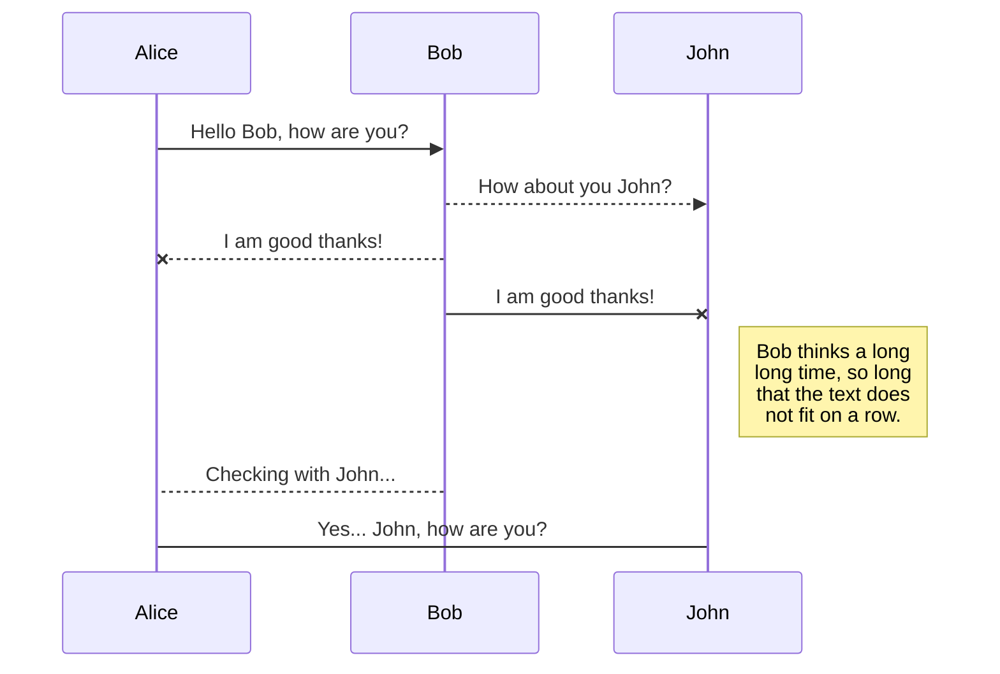
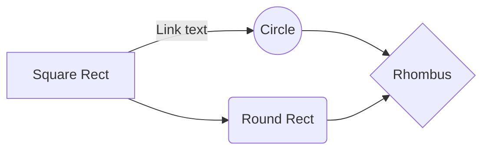

<br />

*italic*

<hr>

**bold**

<hr>

~~strike through~~

<hr>

> this is a block quote
> it goes like this
>
> if you want space, put arrow head in blank line
> you can also the the html `<blockquote>` tags

<hr>

### task list
- [x] flip
- [ ] flap
- [ ] flop

<hr>

<ul>
    <li>unordered list</li>
</ul>

<hr>

<ol>
    <li>ordered list</li>
</ol>

<hr>

| Col 1  | Col 2 |
| ------------- | ------------- |
| tables  | don't you  |
| are fun  | think so?  |

<hr>

```print("This is code") ```

<hr>

```json
{
    "This is" : "specific code"
}
```

<hr>

emojis are fine 😍
[emoji index](https://unicode.org/emoji/charts/full-emoji-list.html)

<hr>

not supported in *GitHub*:

<span style="background-color: darkslategray; color: cyan"> text and highlight colors supported as inline-styles </span>

supported in *GitHub* (this may not display in other previewers):

```diff
- text in red
+ text in green
! text in orange
# text in gray
@@ text in purple (and bold)@@
```

<hr>

basic link [My ToolBox](https://anthonybench.github.io)

<hr>

email <anthonybenchyep@gmail.com>

<hr>

basic image: \


tagged image, more control, \
you can stack image tags by adding the `align="left"` attribute: \


<br />

<hr>

section jump [`Table of Contents`](#table-of-contents-)

(links must omit special characters and emojis, and spaces must have dashes. Underscores do not count as special characters. special means *anything* not alpha-numeric. this may not work in other previewers.)

<hr>

badges:

* license/GitHub

* Analysis/HitHub top language

* Analysis/GitHub language count

* Make new badge: [shield.io](https://shields.io/)
* [MIT License Link](https://opensource.org/licenses/MIT)

<hr>

You can render LaTeX mathematical expressions using [KaTeX](https://khan.github.io/KaTeX/):

The *Gamma function* satisfying $\Gamma(n) = (n-1)!\quad\forall n\in\mathbb N$ is via the Euler integral

$$
\Gamma(z) = \int_0^\infty t^{z-1}e^{-t}dt\,.
$$

> You can find more information about **LaTeX** mathematical expressions [here](http://meta.math.stackexchange.com/questions/5020/mathjax-basic-tutorial-and-quick-reference).


<hr>

You can render UML diagrams using [Mermaid](https://mermaidjs.github.io/). For example, this will produce a sequence diagram:



And this will produce a flow chart:

